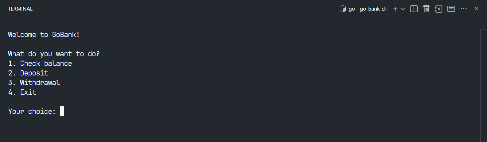
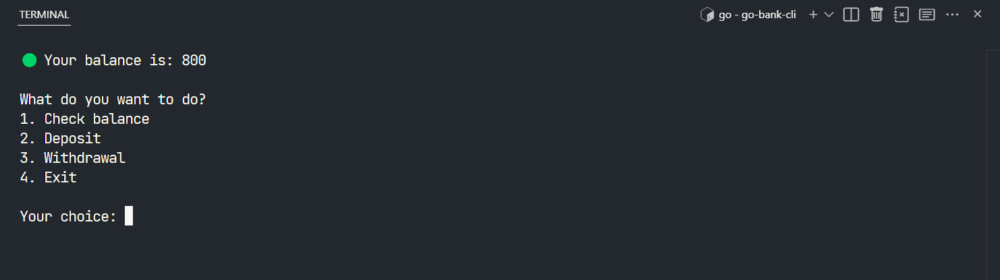
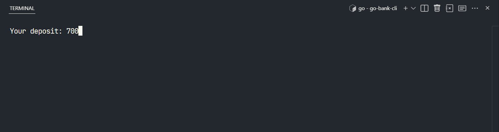
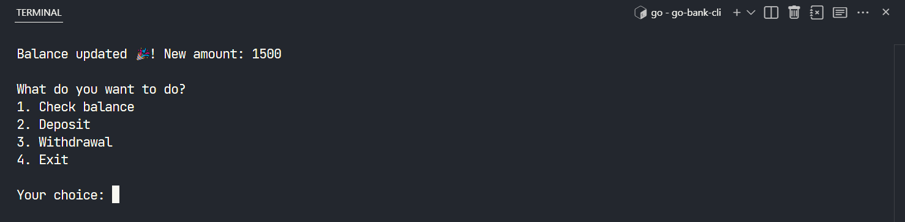
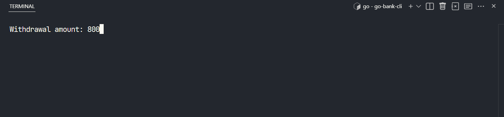
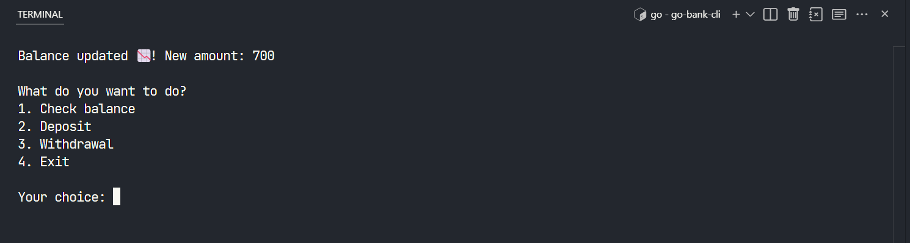
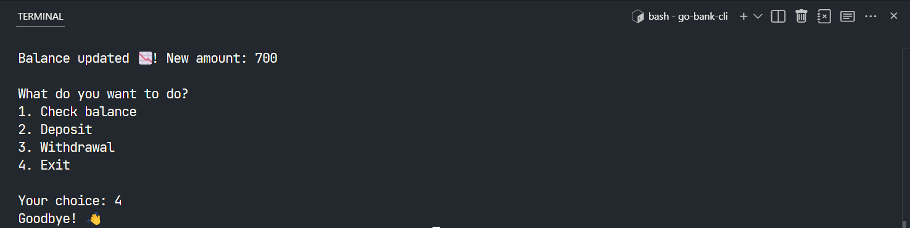
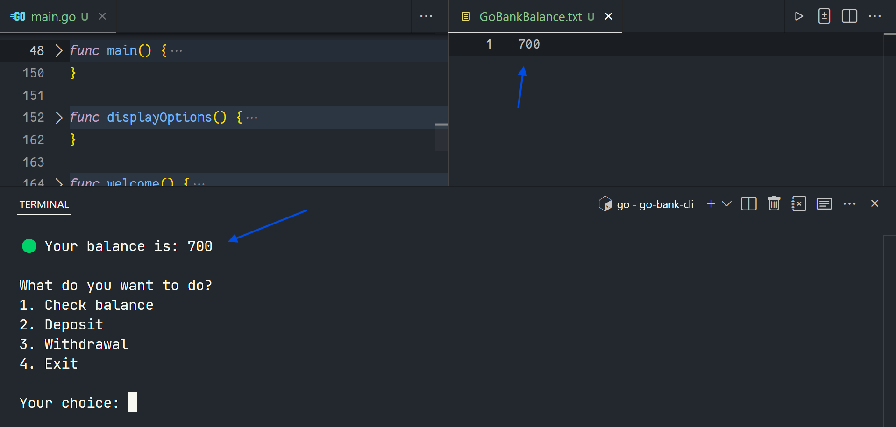

# GO bank CLI

Learning Go by building a simple bank application on the command line.

# Preview

## Welcome

## Check balance

## Deposit

## Withdrawal

## Exit

## Balance to file
The balance is persisted in a .txt file

